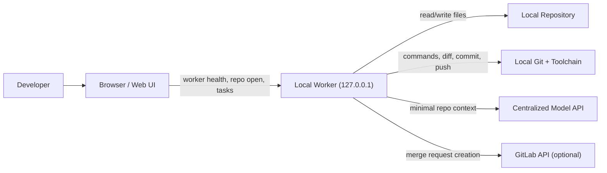
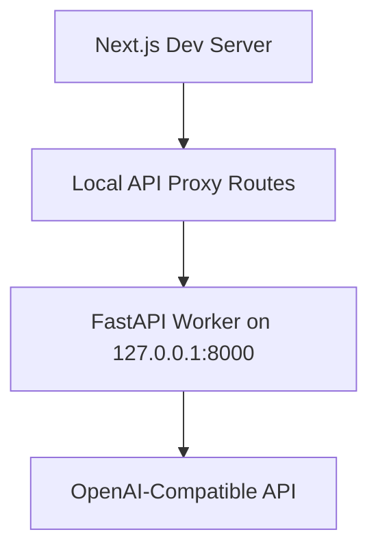

# RepoOperator Architecture Diagram

This diagram shows the current intended RepoOperator architecture and the current localhost expectation for the local worker.

## High-Level Diagram

## Localhost Expectation

The key operational assumption is:

- the worker runs on the developer machine
- the worker binds to `127.0.0.1`
- repository operations do not happen on a central clone

That means the worker is the only component that:

- sees the full local working tree
- executes local commands
- performs local git operations

## Current Development Topology

This is the current practical development setup. A future hosted version will need a more deliberate browser-to-local-worker connection design.

## Why The Worker Stays Local

- repository state is already on the user machine
- command execution is only meaningful in the local environment
- credentials and development tooling are often local
- fewer repository contents need to leave the machine

## Related Docs

- [Architecture](architecture.md)
- [Security](security.md)
- [Deployment guide](../DEPLOYMENT.md)
